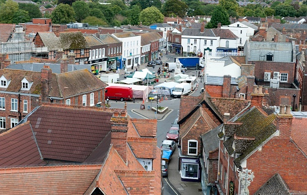

Cuando llegamos ha Inglaterra primero viviamos en Liverpool, y ahora vivimos en Wantage. Yo solo tenia seis años y no entendia absolutamente nada en ingles.

## Liverpool 

Puerto de Liverpool

Liverpool es una ciudad que esta al norte de Inglaterra,es famosa porque allí nacieron "Los Beetles".

Wikipedia enlace [Liverpool](https://en.wikipedia.org/wiki/Liverpool).

## Wantage

Cuando yo vivia en Liverpool no iba ha ningún colegio pero cuando me fui ha vivir ha Wantage empeze ha ir al colegio Charlton Primary School.

                      Este es el logo de mi colegio.

 Esta es la plaza de Wantage.
