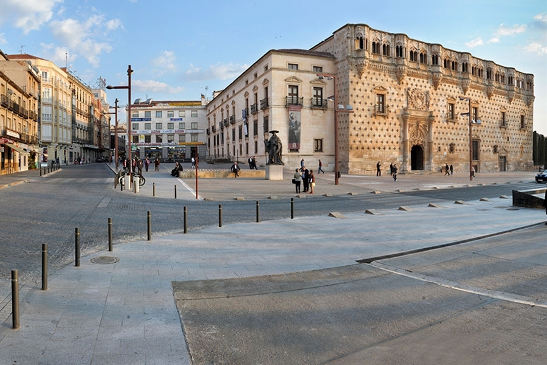
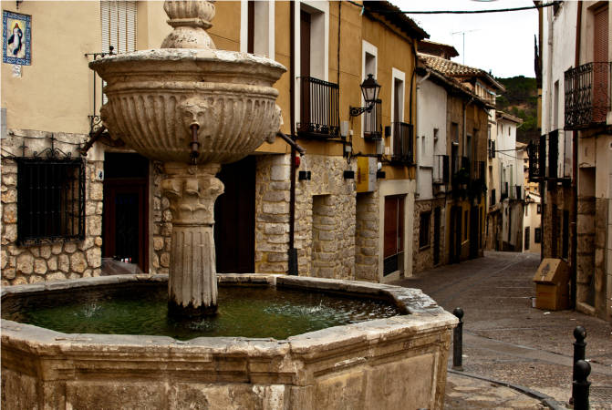

España es donde yo naci, allí tengo a mis amigas, mi familia y sobretodo mi casa.

Guadalajara

([Wikipedia Link](https://es.wikipedia.org/wiki/Guadalajara_(España)))

## Comida Española

En España la comida esta riquísima ¡que a mi me gustan TODAS!
Estas son las comidas que mas me gustan:

| Número | Comida                                      |  |
| :----- | :------------------------------------------ |-:|
| 1      | La Paella                                   |  |
| 2      | La Tortilla de Patata                       |  |
| 3      | La Sangria {Que no tengo ni idea de que es!}|  |
| 4      | El Cocido madrileño                         |  |
| 5      | Las Croquetas                               |  |
| 6      | El jamón y el chorizo                       |  |

## Pastrana

Pastrana es mi pueblo esta en la prenincia de Gualadajara. Siempre que voy ha Pastrana hay están mis primos.

Fuente de los Cuatro Caños

